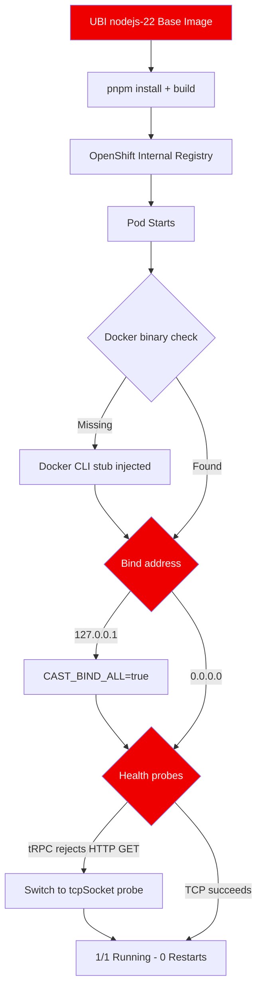

# Deploying Cast on OpenShift: A Multi-Agent Harness Meets Kubernetes

Running AI agents in production requires more than a working prototype. It requires isolation, access control, and infrastructure that does not fall over when real users show up. [Cast](https://github.com/yaodub/cast) is an open-source, multi-user, multi-agent harness that routes messages to Claude-powered agents running in isolated containers, with per-user ACLs managed through configuration rather than embedded in prompts. We deployed it on OpenShift to see how well it fits into a Kubernetes-native workflow. The short answer: it works, but we had to fix a few assumptions along the way.

## What Cast Does and Why It Matters

Most agent frameworks treat access control as an afterthought. Cast takes a different approach. It provides a config-driven ACL layer that controls which users can reach which agents, without baking permissions into prompt text. The architecture is a pnpm monorepo built on Node.js 22, TypeScript, Express 5, and Preact for the web UI, with better-sqlite3 for lightweight persistence. The core deployable component is `cast-server`, which handles agent routing, session management, and an SSE-based admin event stream.

This design makes Cast interesting for teams that need to run multiple Claude-powered agents behind a single entry point with real access control. The question we wanted to answer: can we containerize it on UBI and run it on OpenShift without forking the project?

## Containerizing a pnpm Monorepo on UBI

We started with `registry.access.redhat.com/ubi9/nodejs-22` as the base image. The pnpm monorepo structure required a multi-step build pipeline: install dependencies, bundle the server, and build the web UI. The Dockerfile follows a standard pattern for pnpm workspaces:

```dockerfile
FROM registry.access.redhat.com/ubi9/nodejs-22

COPY . /opt/app-root/src
RUN npm install -g pnpm && \
    pnpm install --frozen-lockfile && \
    pnpm run build
```

We initially planned to push the built image to Quay.io, but hit rate limits during the push. Instead, we switched to OpenShift's internal registry, which avoids external rate limiting entirely and keeps image pulls local to the cluster. This is a pattern worth remembering for any PoC where you do not need the image to be publicly accessible.

The pnpm build ran cleanly on UBI with nodejs-22. No native module compilation issues, no missing system libraries. better-sqlite3 compiled without intervention, which is not always the case on minimal base images.

## The Deployment Challenges

The first deployment went into `CrashLoopBackOff` immediately. Three distinct issues surfaced, each rooted in assumptions that hold on a developer laptop but break in Kubernetes.

### Challenge 1: The Docker Dependency

Cast checks for a Docker binary at startup. On a developer machine, Docker Desktop is always present. On OpenShift, it is not. The container runtime is CRI-O, and there is no `docker` CLI in the path.

We solved this with a stub script that satisfies the startup check without requiring an actual Docker daemon:

```bash
#!/bin/sh
echo "Docker stub for Kubernetes deployment"
```

Placed at `/usr/local/bin/docker` and made executable, this let Cast proceed past its runtime check. The agents themselves run as processes within the Cast server, so no container-in-container capability was needed.

### Challenge 2: Localhost-Only Binding

Cast hardcodes its bind address to `127.0.0.1`. This is fine for local development but breaks Kubernetes health checks and service routing, which need to reach the pod on its cluster IP.

We added a `CAST_BIND_ALL` environment variable to the deployment manifest. When set, the server binds to `0.0.0.0` instead of localhost. This is a one-line change in the deployment YAML:

```yaml
env:
  - name: CAST_BIND_ALL
    value: "true"
```

### Challenge 3: tRPC Health Probes

OpenShift uses HTTP readiness and liveness probes by default. Cast exposes its API through tRPC, which does not respond to plain HTTP GET requests the way a standard REST endpoint would. Our initial `httpGet` probes against the tRPC endpoints returned errors, causing the pod to cycle.

The fix was switching to `tcpSocket` probes on port 8080:

```yaml
readinessProbe:
  tcpSocket:
    port: 8080
  initialDelaySeconds: 5
  periodSeconds: 10
```

TCP probes verify the server is listening without requiring a specific HTTP response format. This is the right choice for any application that uses a non-REST protocol on its primary port.

The following diagram shows how these fixes fit into the deployment flow:



## Test Results

With all three fixes in place, the pod reached `1/1 Running` with zero restarts. We ran four validation tests, all of which passed:

| Test | Method | Result |
|---|---|---|
| TCP connectivity | Socket connect to port 8080 | PASS |
| Agent listing | tRPC `agent.list` call | PASS (empty array, fresh install) |
| Session auth | Auth endpoint check | PASS (`authenticated: true`) |
| Admin SSE stream | Admin changes endpoint | PASS (HTTP 200) |

The empty agent list is expected on a fresh deployment with no agents configured. The session auth and SSE results confirm that Cast's core routing and event infrastructure is functional in the cluster.

## What We Learned

Five takeaways from this PoC:

**Projects that assume Docker Desktop need runtime stubs for Kubernetes.** Cast is not the only project that checks for a Docker binary at startup. Any tool that shells out to `docker` for ancillary tasks will hit this on OpenShift. A stub script is a low-risk fix when the actual Docker functionality is not required at runtime.

**Localhost-only bindings break Kubernetes health checks.** This is a common issue with applications designed for single-machine use. If the application does not have a configuration option for the bind address, you need to patch it or add one upstream.

**tRPC endpoints are not HTTP health endpoints.** Standard readiness probes assume a path that returns 200 on GET. tRPC does not work that way. Use `tcpSocket` probes instead of `httpGet` when the application protocol is not plain REST.

**OpenShift's internal registry avoids external rate limits.** Quay.io and Docker Hub both enforce pull and push rate limits. For PoC work where public access is not needed, the internal registry is faster and eliminates a failure mode.

**pnpm monorepos build cleanly on UBI with nodejs-22.** No special workarounds were needed for the pnpm workspace structure or native module compilation. The UBI nodejs-22 image includes the toolchain needed for better-sqlite3 and similar native dependencies.

## Try It Yourself

Cast is MIT-licensed and available at [github.com/yaodub/cast](https://github.com/yaodub/cast). To reproduce this deployment:

1. Clone the repository and identify `cast-server` as the deployable target
2. Build using the UBI nodejs-22 base image with pnpm
3. Add a Docker CLI stub at `/usr/local/bin/docker`
4. Set `CAST_BIND_ALL=true` in your deployment environment
5. Use `tcpSocket` probes on port 8080 instead of HTTP probes
6. Deploy to OpenShift using the internal registry

The three fixes we applied are generalizable. If you are deploying any Node.js application that was built for local Docker-based development, expect to hit at least one of these issues on Kubernetes. The patterns here will save you a few rounds of `CrashLoopBackOff` debugging.
