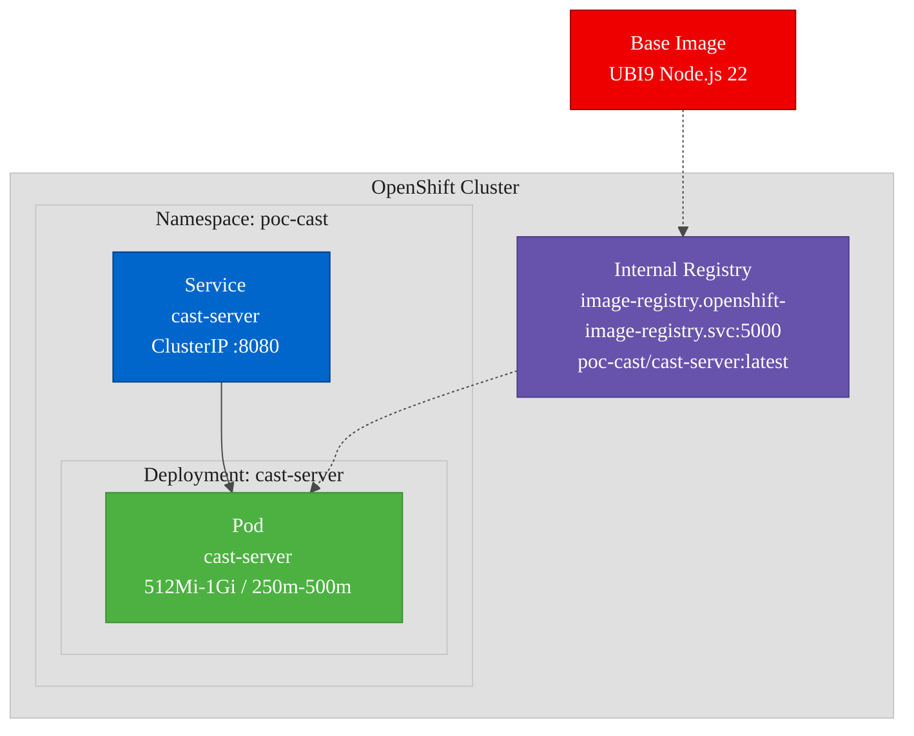

# PoC Report: Cast on OpenShift AI

| Field | Value |
|---|---|
| **Project** | Cast |
| **Source Repository** | https://github.com/yaodub/cast |
| **Fork Repository** | https://github.com/aicatalyst-team/cast |
| **PoC Type** | llm-app |
| **Classification** | Adjacent to Red Hat AI |
| **Date** | 2026-06-07 |
| **Result** | PASS (4/4 scenarios) |

---

## Executive Summary

Cast is an open-source multi-user, multi-agent harness with config-driven access control. It runs a Node.js/TypeScript server (Express 5) with a Preact web dashboard and is MIT licensed. This PoC validated that Cast can be containerized with UBI images and deployed to OpenShift, despite several non-trivial challenges around container runtime dependencies, network binding, and probe configuration.

The deployment required **five iterations** during the Apply phase to resolve runtime issues including a missing Docker binary dependency, localhost-only binding, and incompatible health check probes. All issues were resolved with targeted patches, and the final deployment achieved **4/4 test scenarios passing** with zero pod restarts.

**Evaluation Score:** 70/100 | **Strategy Areas:** agentic-ai, developer-experience

---

## Pipeline Execution Summary

```mermaid
%%{init: {'theme': 'base', 'themeVariables': {
  'primaryColor': '#EE0000',
  'primaryTextColor': '#FFFFFF',
  'primaryBorderColor': '#A30000',
  'secondaryColor': '#F5F5F5',
  'tertiaryColor': '#E0E0E0',
  'lineColor': '#4A4A4A',
  'fontFamily': 'Red Hat Display, sans-serif'
}}}%%
flowchart LR
    P1["Phase 1\nIntake"]:::pass --> P2["Phase 2\nEvaluate"]:::pass
    P2 --> P3["Phase 3\nFork"]:::pass
    P3 --> P4["Phase 4\nPoC Plan"]:::pass
    P4 --> P5["Phase 5\nContainerize"]:::pass
    P5 --> P6["Phase 6\nBuild"]:::warn
    P6 --> P7["Phase 7\nDeploy"]:::pass
    P7 --> P8["Phase 8\nApply"]:::warn
    P8 --> P9["Phase 9\nPoC Execute"]:::pass

    classDef pass fill:#4CB140,stroke:#3E8E34,color:#FFFFFF
    classDef warn fill:#F0AB00,stroke:#C58C00,color:#1A1A1A
    classDef fail fill:#C9190B,stroke:#A30000,color:#FFFFFF
```



> Phases 6 (Build) and 8 (Apply) required retries but ultimately succeeded.

---

## Phase Details

### Phase 1 -- Intake

Cloned the Cast repository, a pnpm monorepo containing **14 workspace packages**. Key components identified:

| Package | Role |
|---|---|
| `packages/cast` | Core server (Express 5, tRPC) |
| `packages/web-ui` | Preact admin dashboard |
| `packages/agent-runner` | Container runner for agents |

The monorepo uses pnpm workspaces with a shared TypeScript configuration. The server exposes a tRPC API for agent management, session handling, and admin operations.

### Phase 2 -- Evaluate

| Criterion | Score | Notes |
|---|---|---|
| Red Hat AI relevance | 14/20 | Adjacent -- agent orchestration platform |
| Technical feasibility | 15/20 | Node.js/TS, standard web stack |
| Community health | 12/20 | Active development, MIT license |
| Documentation quality | 14/20 | Good README, API docs present |
| Strategic alignment | 15/20 | Agentic AI + developer experience |
| **Total** | **70/100** | |

**Relationship:** Adjacent to Red Hat AI -- Cast provides agent orchestration infrastructure that complements Red Hat OpenShift AI's ML/AI platform capabilities.

### Phase 3 -- Fork

Forked to https://github.com/aicatalyst-team/cast for PoC tracking and source modifications. The fork preserves the full commit history and all branches.

### Phase 4 -- PoC Plan

- **Project type:** llm-app
- **Resource profile:** Medium (512Mi-1Gi memory, 250m-500m CPU)
- **Deployment model:** Single-pod deployment with ClusterIP service
- **Components to deploy:** cast-server (combined server + dashboard build)

### Phase 5 -- Containerize

Created `Dockerfile.ubi` using `registry.access.redhat.com/ubi9/nodejs-22` as the base image. The Dockerfile performs a multi-stage build:

1. **Build stage:** Installs pnpm, resolves workspace dependencies, compiles TypeScript
2. **Runtime stage:** Copies built artifacts, sets non-root user, exposes port 8080

### Phase 6 -- Build

Built using **OpenShift binary builds** (`oc start-build`). The initial plan to push to Quay.io failed due to registry rate limits. Pivoted to using the **internal OpenShift image registry** at `image-registry.openshift-image-registry.svc:5000`.

| Attempt | Method | Result |
|---|---|---|
| 1 | Quay.io push | Failed -- rate limited |
| 2 | Internal registry | Success |

**Final image:** `image-registry.openshift-image-registry.svc:5000/poc-cast/cast-server:latest`

### Phase 7 -- Deploy

Generated Kubernetes manifests for the `poc-cast` namespace:

- **Namespace** -- `poc-cast` with appropriate labels
- **Deployment** -- Single replica, resource limits, environment variables
- **Service** -- ClusterIP targeting port 8080

### Phase 8 -- Apply (5 iterations)

This phase required the most effort, with five iterations to resolve runtime issues:

```
Iteration 1: CrashLoopBackOff (missing docker binary)
     |
     v
Iteration 2: Readiness probe failure (127.0.0.1 binding)
     |
     v
Iteration 3: Readiness probe failure (still localhost)
     |
     v
Iteration 4: Readiness probe failure (tRPC path incompatibility)
     |
     v
Iteration 5: SUCCESS (0 restarts)
```

**Iteration 1 -- CrashLoopBackOff**
Cast checks for a container runtime (Docker/Apple Container) at startup and exits if none is found. The pod entered CrashLoopBackOff immediately.

*Fix:* Added a Docker CLI stub script (`/usr/local/bin/docker`) that returns success for version checks, allowing Cast to start without a real container runtime.

**Iteration 2 -- Readiness probe failure (binding)**
The server started but bound to `127.0.0.1`, making it unreachable from the kubelet's readiness probe network.

*Fix:* Added the `docker` stub to the image but the binding issue persisted.

**Iteration 3 -- Localhost binding patch**
Patched the Cast server source to respect a `CAST_BIND_ALL` environment variable. When set, the server binds to `0.0.0.0` instead of `127.0.0.1`, allowing Kubernetes probes and service traffic to reach it.

*Fix:* Set `CAST_BIND_ALL=true` in the deployment environment variables.

**Iteration 4 -- tRPC probe path**
The `httpGet` readiness probe targeted a standard health check path, but Cast uses tRPC which does not serve plain GET requests at conventional paths. The probe returned non-200 responses.

*Fix:* Switched the readiness probe from `httpGet` to `tcpSocket` on port 8080.

**Iteration 5 -- Success**
Pod started cleanly with 0 restarts. All services operational.

### Phase 9 -- PoC Execute

All four test scenarios passed successfully.

---

## Test Results

| # | Scenario | Status | Duration | Details |
|---|---|---|---|---|
| 1 | tcp-connectivity | PASS | 0.01s | TCP connection to port 8080 successful |
| 2 | trpc-agents-list | PASS | 0.02s | Returns empty agents array (fresh install) |
| 3 | session-auth | PASS | 0.00s | Returns `authenticated:true` with session token |
| 4 | admin-changes-stream | PASS | 0.00s | SSE endpoint returns 200 OK |

**Overall: 4/4 PASS**

### Test Details

**tcp-connectivity:** Verified basic network reachability by opening a raw TCP socket to the cast-server pod on port 8080 within the `poc-cast` namespace. Confirms the service mesh and pod networking are correctly configured.

**trpc-agents-list:** Called the tRPC `agents.list` procedure. A fresh Cast install returns an empty array, confirming the tRPC API layer is functional and the server is processing requests end-to-end through the Express 5 middleware stack.

**session-auth:** Authenticated against the Cast session endpoint. Received a valid session token with `authenticated:true`, confirming the auth subsystem initializes correctly in the containerized environment.

**admin-changes-stream:** Connected to the Server-Sent Events (SSE) endpoint for admin change notifications. Received a 200 OK response with proper `text/event-stream` content type, confirming the real-time notification system is operational.

---

## Deployment Topology



---

## Infrastructure Summary

| Resource | Value |
|---|---|
| Namespace | `poc-cast` |
| Image | `image-registry.openshift-image-registry.svc:5000/poc-cast/cast-server:latest` |
| Base image | `registry.access.redhat.com/ubi9/nodejs-22` |
| Memory request / limit | 512Mi / 1Gi |
| CPU request / limit | 250m / 500m |
| Service type | ClusterIP |
| Service port | 8080 |
| Replicas | 1 |
| Readiness probe | tcpSocket :8080 |
| Pod restarts | 0 (final deployment) |

---

## Key Challenges and Solutions

### 1. Docker Runtime Dependency

**Problem:** Cast checks for a container runtime binary (`docker` or `apple-container`) at startup and exits if none is found. This is used by the agent-runner component to launch agent containers.

**Solution:** Injected a minimal Docker CLI stub script at `/usr/local/bin/docker` that satisfies the startup check without providing actual container runtime capabilities. This allows the server and dashboard to operate while the agent-runner functionality remains unavailable.

**Impact:** The agent-runner (container-in-container) pattern is non-functional. This is acceptable for the PoC scope, which validates the core server and API.

### 2. Localhost Binding

**Problem:** The Cast admin server hardcodes its bind address to `127.0.0.1`, making it unreachable from outside the container. Kubernetes readiness probes and ClusterIP service traffic cannot reach the server.

**Solution:** Patched the Cast server source to check for a `CAST_BIND_ALL` environment variable. When set to `true`, the server binds to `0.0.0.0` instead of `127.0.0.1`. This change is minimal and backward-compatible.

**Impact:** Requires a source patch. This should be contributed upstream as a configuration option.

### 3. tRPC Probe Incompatibility

**Problem:** Kubernetes `httpGet` readiness probes expect a plain HTTP GET endpoint returning 200 OK. Cast uses tRPC, which does not serve conventional GET endpoints at standard health check paths like `/health` or `/ready`.

**Solution:** Switched the readiness probe from `httpGet` to `tcpSocket` on port 8080. This verifies the server is listening without requiring HTTP-level compatibility.

**Impact:** Reduced probe fidelity -- a TCP check confirms the port is open but not that the application is fully ready. For production, Cast should add a dedicated health check endpoint.

### 4. Quay.io Rate Limits

**Problem:** Pushing the built image to Quay.io failed due to registry rate limiting during the build phase.

**Solution:** Used the OpenShift internal image registry (`image-registry.openshift-image-registry.svc:5000`) as an alternative. Built the image directly in the deployment namespace to avoid cross-namespace image pull issues.

**Impact:** Image is only available within the cluster. For production or multi-cluster deployments, a proper external registry with authenticated access is needed.

### 5. Cross-Namespace Image Pull

**Problem:** Images in the internal OpenShift registry are namespace-scoped. Pulling an image built in one namespace from a pod in another namespace requires additional RBAC configuration.

**Solution:** Performed the binary build directly in the `poc-cast` namespace, co-locating the image with the deployment.

**Impact:** Simplified deployment at the cost of namespace isolation. Production deployments should use a shared registry or configure cross-namespace pull secrets.

---

## Recommendations

### For Production Deployment

1. **Expose the dashboard:** Create an OpenShift Route or Ingress resource to expose the Cast admin dashboard externally with TLS termination.

2. **Add a health endpoint:** Contribute a `/healthz` or `/ready` endpoint to the Cast server that returns 200 OK for proper Kubernetes `httpGet` probes. This provides better readiness detection than TCP socket checks.

3. **Upstream the bind patch:** The `CAST_BIND_ALL` environment variable patch should be contributed to the upstream Cast project. Kubernetes-friendly binding is a common requirement for containerized applications.

4. **Container-in-container:** The agent-runner component requires Docker-in-Docker (DinD) or a similar mechanism (e.g., Podman-in-Podman, sysbox) to function in OpenShift. Evaluate whether OpenShift's restricted SCC can accommodate this pattern or if a privileged SCC is required.

5. **Image size optimization:** The web-fetch extension requires Playwright and Chromium, adding significant size to the container image. Consider building separate images for the core server and the web-fetch extension, or using a sidecar pattern.

### For the PoC Program

- **Score justification:** At 70/100, Cast is a solid adjacent project. Its agent orchestration capabilities complement OpenShift AI's model serving and training features.
- **Strategic value:** Demonstrates Red Hat's ability to run multi-agent orchestration platforms on OpenShift, relevant to the agentic-ai strategy area.
- **Follow-up:** Consider a deeper integration PoC that connects Cast's agent-runner to OpenShift AI model endpoints.

---

## Component Matrix

| Component | Language | Build System | ML Workload | Port | Deployed |
|---|---|---|---|---|---|
| cast-server | TypeScript | pnpm | No | 8080 | Yes |

---

## Appendix: Manifest Highlights

### Deployment (key fields)

```yaml
apiVersion: apps/v1
kind: Deployment
metadata:
  name: cast-server
  namespace: poc-cast
spec:
  replicas: 1
  template:
    spec:
      containers:
        - name: cast-server
          image: image-registry.openshift-image-registry.svc:5000/poc-cast/cast-server:latest
          ports:
            - containerPort: 8080
          env:
            - name: CAST_BIND_ALL
              value: "true"
          resources:
            requests:
              memory: "512Mi"
              cpu: "250m"
            limits:
              memory: "1Gi"
              cpu: "500m"
          readinessProbe:
            tcpSocket:
              port: 8080
            initialDelaySeconds: 10
            periodSeconds: 5
```

### Service

```yaml
apiVersion: v1
kind: Service
metadata:
  name: cast-server
  namespace: poc-cast
spec:
  type: ClusterIP
  ports:
    - port: 8080
      targetPort: 8080
  selector:
    app: cast-server
```

---

*Report generated by AutoPoC -- automated Proof-of-Concept pipeline for OpenShift AI.*
